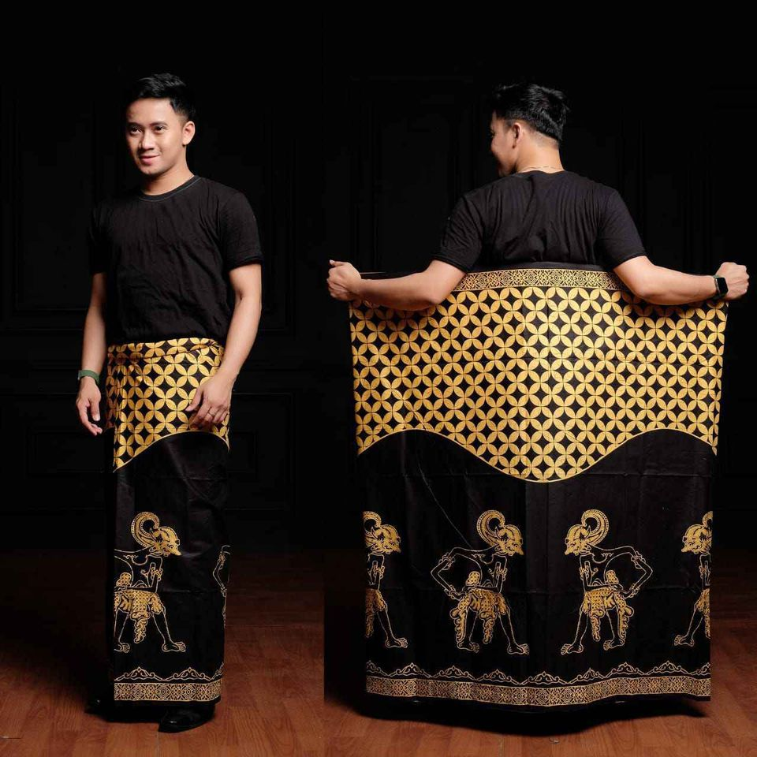
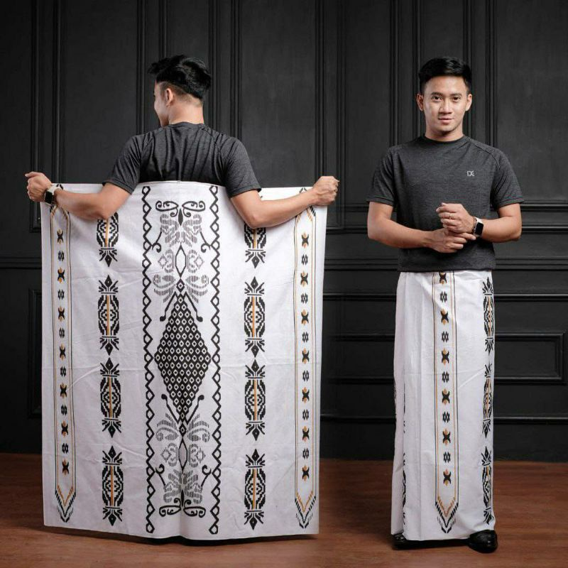
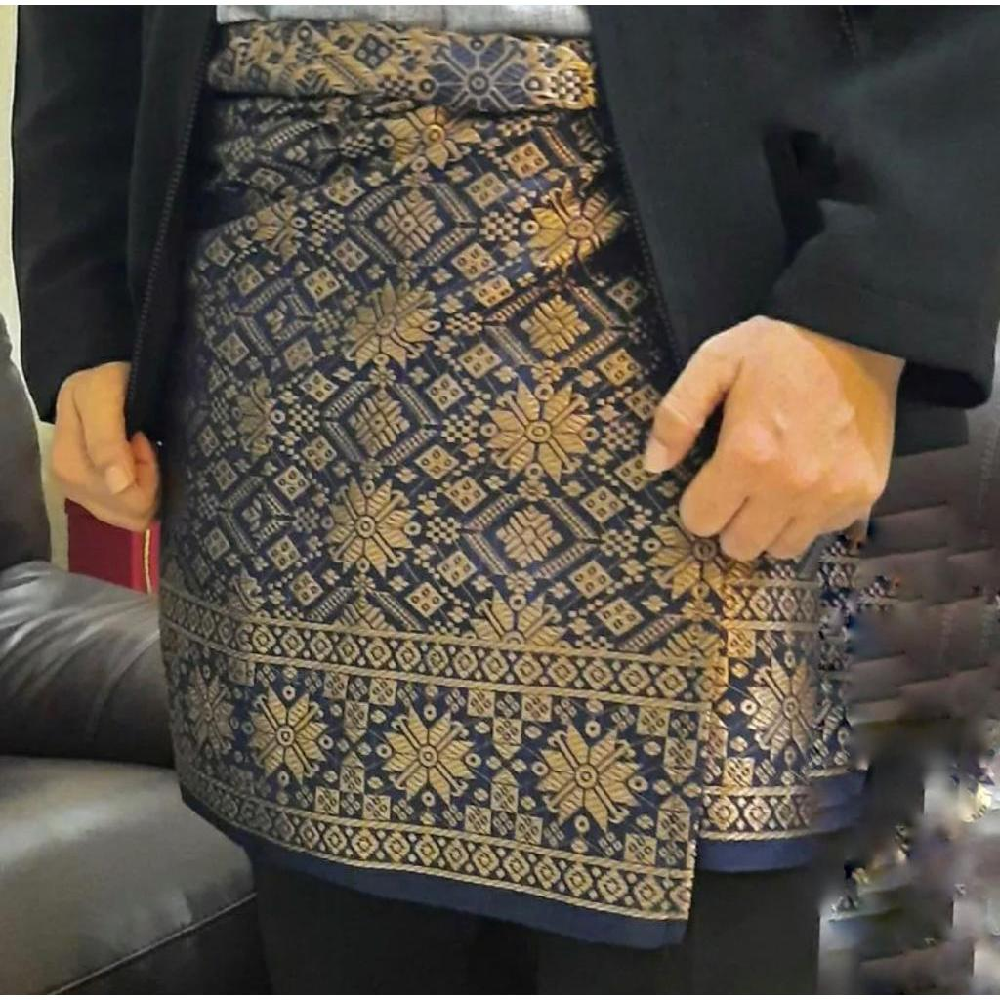
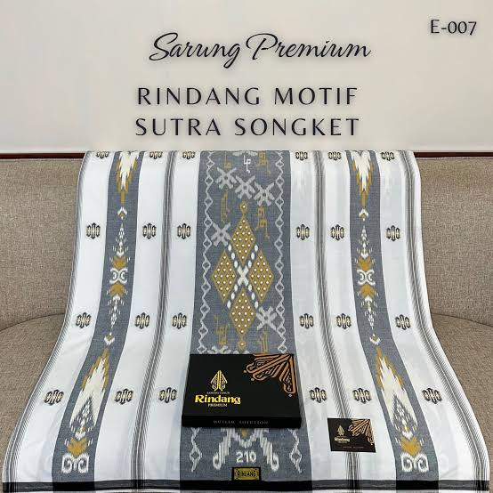

<html lang="id">
<head>
    <meta charset="UTF-8">
    <meta name="viewport" content="width=device-width, initial-scale=1.0">
    <title>Toko Sarung Bang Doel - Sarung Asli Bandung</title>
    <link href="https://fonts.googleapis.com/css2?family=Poppins:wght@300;400;600;700&family=DM+Serif+Display&family=Great+Vibes&display=swap" rel="stylesheet">
    <link rel="stylesheet" href="style.css">
</head>
<body>
    <header>
        <h1>Toko Sarung Bang Doel</h1>
        

            🛒
            0
        

    </header>
    
    <nav>
        <ul>
            <li><a href="#beranda">Beranda</a></li>
            <li><a href="#produk">Produk</a></li>
            <li><a href="#kategori">Kategori</a></li>
            <li><a href="#tentang">Tentang Kami</a></li>
            <li><a href="#kontak">Kontak</a></li>
        </ul>
    </nav>
    
    <main>
        <section id="beranda" class="hero">
            <h2>Selamat Datang di Toko Sarung Bang Doel</h2>
            
Koleksi sarung tradisional dan modern terbaik dari Bandung dengan kualitas premium dan harga terjangkau

        </section>
        
        <section id="kategori">
            <h2 class="section-title">Kategori Produk</h2>
            

                <a href="#" class="category">
                    <h3>Sarung Batik</h3>
                    
Motif tradisional dan modern

                </a>
                <a href="#" class="category">
                    <h3>Sarung Tenun</h3>
                    
Tenun ikat berkualitas tinggi

                </a>
                <a href="#" class="category">
                    <h3>Sarung Songket</h3>
                    
Mewah dengan benang emas

                </a>
                <a href="#" class="category">
                    <h3>Sarung Modern</h3>
                    
Desain kontemporer

                </a>
            

        </section>
        
        <section id="produk">
            <h2 class="section-title">Produk Terbaru</h2>
            

                <article class="product">
                    
                    

                        <h3>Sarung Batik Tradisional Bandung</h3>
                        
Sarung batik dengan motif tradisional dan motif wayang, dibuat dengan teknik canting tulis asli Bandung. Bahan katun premium yang nyaman dan tahan lama.

                        
Rp 350.000

                        <button class="buy-btn" onclick="addToCart(1, 'Sarung Batik Tradisional Bandung', 350000)">Beli Sekarang</button>
                    

                </article>
                
                <article class="product">
                    
                    

                        <h3>Sarung Tenun Ikat Bandung</h3>
                        
Sarung tenun khas Nusa Tenggara, ditenun manual dengan benang katun pilihan terbaik. Motif etnik yang memukau dan bernilai seni tinggi.

                        
Rp 450.000

                        <button class="buy-btn" onclick="addToCart(2, 'Sarung Tenun Ikat Bandung', 450000)">Beli Sekarang</button>
                    

                </article>
                
                <article class="product">
                    
                    

                        <h3>Sarung Songket Bandung</h3>
                        
Sarung songket mewah dengan benang emas asli, cocok untuk acara resmi dan pernikahan. Keanggunan tradisional yang tak lekang waktu.

                        
Rp 1.250.000

                        <button class="buy-btn" onclick="addToCart(3, 'Sarung Songket Bandung', 1250000)">Beli Sekarang</button>
                    

                </article>
                
                <article class="product">
                    
                    

                        <h3>Sarung Batik Modern</h3>
                        
Sarung batik dengan motif kontemporer, nyaman dipakai sehari-hari. Perpaduan sempurna antara tradisi dan modernitas.

                        
Rp 180.000

                        <button class="buy-btn" onclick="addToCart(4, 'Sarung Batik Modern', 180000)">Beli Sekarang</button>
                    

                </article>
                
                <article class="product">
                    
                    

                        <h3>Sarung Sutera Premium</h3>
                        
Sarung berbahan sutera halus dengan motif eksklusif. Kemewahan dan kenyamanan dalam satu produk berkualitas tinggi.

                        
Rp 750.000

                        <button class="buy-btn" onclick="addToCart(5, 'Sarung Sutera Premium', 750000)">Beli Sekarang</button>
                    

                </article>
            

        </section>
        
        <section id="tentang" class="about">
            <h3>Tentang Kami</h3>
            
Toko Sarung Bang Doel telah berdiri sejak 2000 dan menjadi toko sarung terpercaya di Bandung. Kami menyediakan berbagai jenis sarung berkualitas tinggi dari berbagai daerah di Indonesia. Dengan pengalaman lebih dari 25 tahun, kami berkomitmen memberikan produk terbaik dengan harga yang kompetitif untuk semua kalangan.

        </section>
    </main>
    
    <!-- Cart Modal -->
    

        

            &times;
            <h2>Keranjang Belanja</h2>
            

            
Total: Rp 0

            <button class="checkout-btn" onclick="checkout()">Checkout</button>
        

    

    
    <!-- Notification -->
    

    
    <footer id="kontak">
        

            

                <h4>Kontak Kami</h4>
                
📍 Jl. H. Djuanda Kec. Cicalengka Kab. Bandung 
                📞 (089) 5364530205 
                📧 info@sarungbangdoel.com

            

            

                <h4>Jam Operasional</h4>
                
Senin - Sabtu: 08:00 - 16:00 
                Minggu: 10:00 - 16:00

            

            

                <h4>Media Sosial</h4>
                

                    <a href="#">Facebook tokosarungbangdoel</a> 
                    <a href="#">Instagram tokosarungbangdoel</a> 
                    <a href="#">WhatsApp (0895364530205)</a>
                

            

        

        

        
&copy; 2025 Toko Sarung Bang Doel. Seluruh hak cipta dilindungi.

    </footer>

    
</body>
</html>
